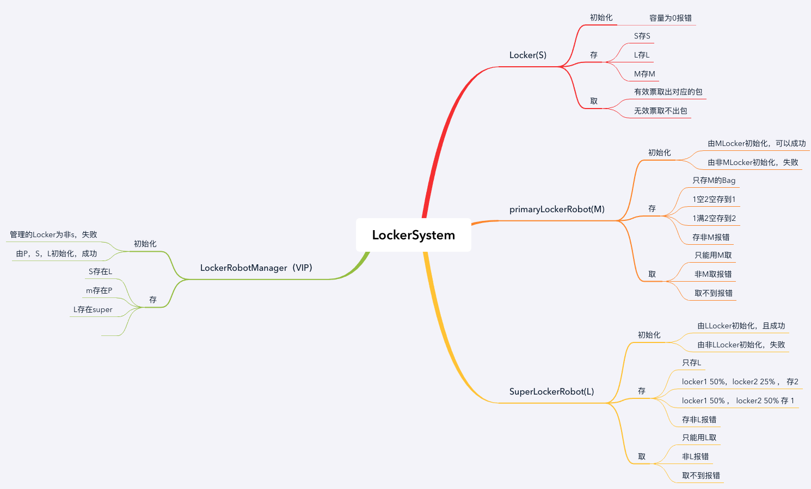

## Tasking mind:

## Tasking
### Locker
#### 初始化
- Given：有一个locker When：配置这个locker的容量小于等于0 Then：得到报错信息，初始化Locker失败，Locker容量不能为0。
- Given：有一个S locker有容量 ， 以及一个S Bag When：使用该Locker存该包 Then：存包成功，得到Ticket且类型为S。
- Given：有一个M locker有容量 ， 以及一个M Bag When：使用该Locker存该包 Then：存包成功，得到Ticket且类型为M。
- Given：有一个L locker有容量 ， 以及一个L Bag When：使用该Locker存该包 Then：存包成功，得到Ticket且类型为L。
- Given：有一个L locker没容量 ， 以及一个L Bag When：使用该Locker存该包 Then：存包失败，该Locker已满。
- Given：有一个L locker有容量, 以及L 的ticket When：使用该Ticket取包 Then：取Bag成功，得到对应的Bag。
- Given：有一个L locker有容量, 以及M 的ticket When：使用该Ticket取包 Then：取Bag失败，得到报错信息，取包失败，请使用正确的Ticket。

